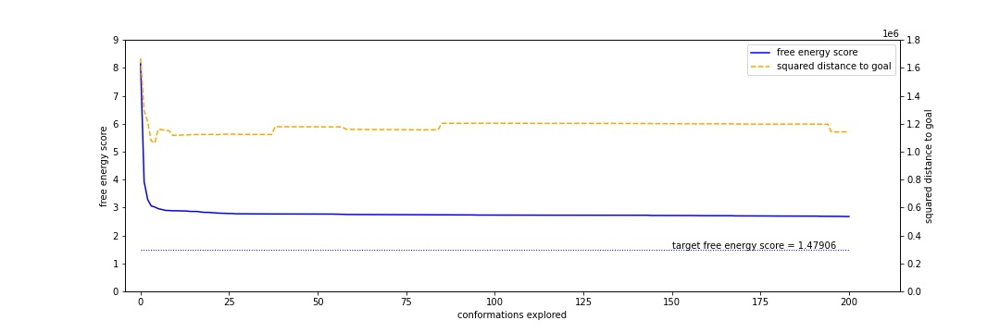
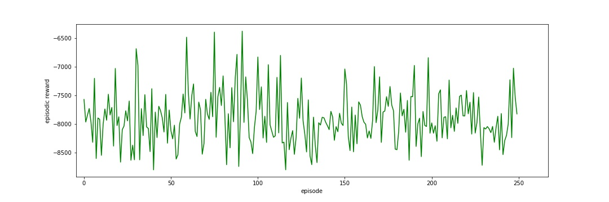
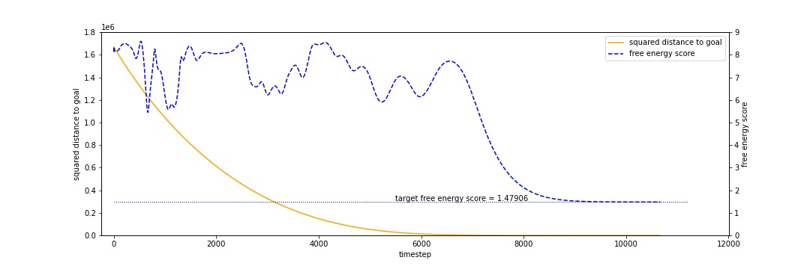

# protein

Scripts associated with my CSCE 790: Deep Reinforcement Learning and Search final project.

## Prerequisites

To run these scripts, you will need to have installed `git`, `conda`, and a modified version of [REDCRAFT](https://redcraft.readthedocs.io/en/latest/) on your system.

### Installing REDCRAFT

These instructions are for Unix-based targets, such as Linux distributions, macOS, and WSL2 environments. If you are using Windows, you are on your own.

1. Clone the REDCRAFT repository within your local directory of choice using the following command:

    ```bash
    git clone https://bitbucket.org/hvalafar/redcraft.git
    ```

2. `cd` into the `redcraft/` directory now on your system. Here we need to do two things. First, fetch the modified version of `molan.cpp` using this command:

    ```bash
    wget https://raw.githubusercontent.com/singhish/RLProteinFolding/main/molan.cpp
    ```

    and replace `src/molan.cpp` with this file. Next, replace the empty `googletest/` directory by running:

    ```bash
    rm -r googletest/
    git clone https://github.com/google/googletest.git
    ```

3. You are now free to follow the instructions located [here](https://redcraft.readthedocs.io/en/latest/usage/installation.html). If you are using WSL2, before running `make`, run the following command:

    ```bash
    sudo strip --remove-section=.note.ABI-tag /usr/lib/x86_64-linux-gnu/libQt5Core.so.5
    ```

4. Test your REDCRAFT installation by running `redcraft`. You should get the following output if the installation was successful:

    ```bash
    $ redcraft
    Usage: redcraft [-S|--script] <binary|script> [options] [-V|--version]
    See redcraft --help or the REDCRAFT documentation for details
    ```

### Conda Environment Setup

To install and activate the prerequisite Python modules for this project, run:

```bash
conda env create -f environment.yml -n protein
conda activate protein
```

## Experiments (TODO: Fill In Details About Results)

Three experiments were done over the course of this project: naive search, DDPG, and Adam-based gradient descent.

### Naive Search

This experiment tries to optimize the protein's "free energy score" evaluated using REDCRAFT by iteratively uniformly sampling a number of new angle measures for each phi/psi angle value of the target protein of interest (here, [2JOF](http://www.rcsb.org/structure/2JOF)). Here, we see that there is initial success, but the free energy score begins to level off and can't approach 2JOF's actual free energy score after 200 iterations (22 minutes, 22.592 seconds of real computation time on an Intel Core i7-6600U CPU). We also note that the similarity of the conformations being obtained to the goal, denoted using the squared L2 distance metric, doesn't converge during the process either.

This experiment can be run using `python naive_search.py`.



### DDPG

This experiment can be run using `python ddpg.py`. It implements the deep reinforcement learning algorithm outlined in [this paper](https://arxiv.org/abs/1509.02971). It's real computation time was 6 hours 1 minute 5.638 seconds on an Nvidia GeForce GTX 1080 GPU. States are all possible phi/psi angle conformations (i.e. all matrices in R ^ (2 x *n*) where *n* in the number of residues the amino acid has, with values bounded between (-180, 180]), actions are real-valued changes in each of the phi/psi angles of a conformation (a continuous action space also of dimension R ^ (2 x *n*)), and the reward function is the negative of the free energy score of a next-state. As can be seen, the performance of DDPG for this context was abysmal, as no convergence occurs after 250 episodes.



### Adam-based Gradient Descent

This experiment can be run using `python adam.py`. The squared L2 distance function is directly optimized using Adam (see [this paper](https://arxiv.org/abs/1412.6980)). Computation is quick at 3 minutes 44.482 seconds on an i7-6600U CPU. This was done to explore how free energy score relates to squared L2 distance.

